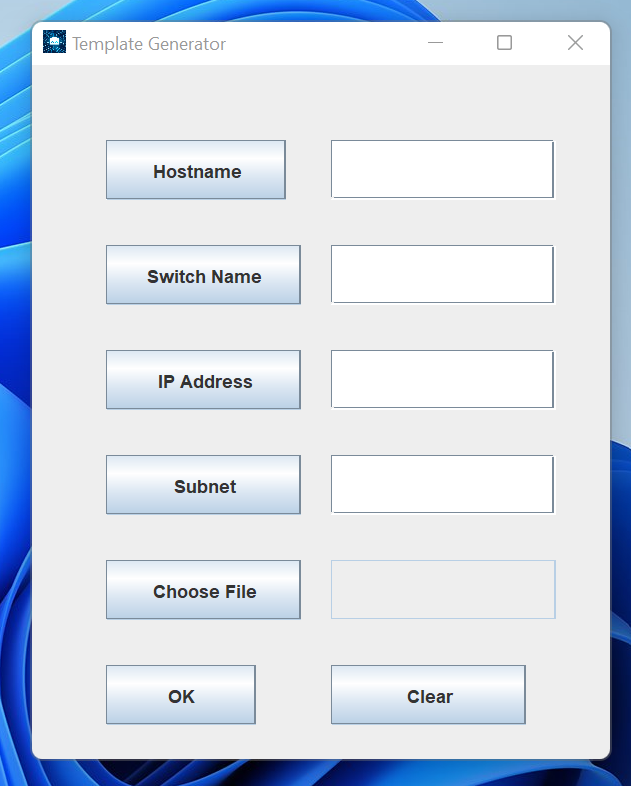

# EasyGo Template Generator

## Overview
The **EasyGo Template Generator** is a desktop application designed to simplify and automate the process of configuring switches. This project was developed while working as an administrator at BHEL, specifically for the department I was associated with. The goal of the application is to reduce manual effort and save time when programming multiple switches by automating repetitive tasks.

## Problem Statement
In the original manual process, each switch configuration required:
- Setting unique values for **hostname**, **switch name**, **IP address**, and **subnet**.
- Repeating the process for every switch, even though the template file structure remained consistent.

This was a time-consuming and error-prone task due to the repetitive nature of string replacements.

## Solution
The **EasyGo Template Generator** automates the above process by:
- Allowing users to input unique values for hostname, switch name, IP address, and subnet.
- Automatically generating the updated configuration file for each switch.
- Using basic string manipulation techniques (string find and replacement) to efficiently handle the updates.

This results in a significant reduction in the time and effort required to configure multiple switches.


## Example
### Input Template
```plaintext
hostname [hostname_placeholder]
switch [switch_placeholder]
ip address [ip_address_placeholder]
subnet mask [subnet_placeholder]
```

### User Input
- Hostname: `A1-SW201`
- Switch name: `Switch_1`
- IP address: `192.168.1.1`
- Subnet mask: `255.255.255.0`

### Generated Output
```plaintext
hostname A1-SW201
switch Switch_1
ip address 192.168.1.1
subnet mask 255.255.255.0
```

## Key Features
- **Template Customization**: Provides a base template for users to configure switches.
- **Automated Replacements**: Replaces placeholders with user-provided data.
- **Batch Processing**: Generates configurations for multiple switches in one go.

## Technical Details
- **Programming Language**: Java
- **Core Functionality**: String find and replace operations.
- **User Interface**: A desktop application with an intuitive GUI.

## Benefits
- Eliminates repetitive manual tasks.
- Reduces configuration errors.
- Speeds up the switch programming process.

## Usage
1. Launch the application.
2. Provide the input template file.
3. Enter unique values for hostname, switch name, IP address, and subnet.
4. Generate the updated configuration files.
5. Save and deploy the configurations to the switches.


Understanding the Routing Concept Over the Firewall in the Given Diagram

This network diagram shows a setup involving switches, VLANs, a firewall, and routing between different subnets. Let's break it down step by step.


---

🔹 Components in the Diagram

1. Switches (24 Port)

VLAN configured.

Connected to multiple devices and the firewall.


2. Firewall

Acts as a gateway between different networks.

Handles traffic between internal and external networks.

Has multiple interfaces with different subnets.


3. Different Subnets in the Network

192.168.0.0/22 → Covers 192.168.0.1 - 192.168.3.254

192.168.71.254/24 → Connected to firewall.

192.168.10.0/24 → Used in routing rules.

10.10.10.0/24 → Another internal network.


4. Routing Entries

192.168.10.0/24 via 192.168.71.99

10.10.10.10/24 via 192.168.71.99


---

🔹 How Routing Works in This Setup

1️⃣ VLAN Routing and Internal Traffic

The switches handle VLANs, which means different subnets can communicate through routing rules.

VLAN connects different parts of the network.

Example: 192.168.3.254 (VLAN Gateway) allows traffic between 192.168.0.2 and other VLAN devices.


2️⃣ Firewall as a Gateway

The firewall is the main routing device between networks.

Traffic between 192.168.x.x and 10.10.x.x goes through the firewall.

The firewall ensures only authorized communication happens.


3️⃣ Routing Rules Explained

192.168.10.0/24 via 192.168.71.99
🔹 Meaning: If any device wants to communicate with 192.168.10.x, it should send traffic to 192.168.71.99, which will route it correctly.

10.10.10.10/24 via 192.168.71.99
🔹 Meaning: Any request to 10.10.10.x should be sent to 192.168.71.99, which will forward it.


4️⃣ Routing Through Firewall

Devices from 192.168.0.0/22 communicate with 192.168.10.0/24 and 10.10.10.0/24 through the firewall.

The firewall manages security rules to allow or deny traffic between these subnets.


---

🔹 Example Communication Flow

1. A PC in 192.168.0.2 wants to access 10.10.10.100

The packet is sent to the VLAN Gateway (192.168.3.254).

Then, it reaches Firewall (192.168.71.99).

The firewall checks the routing rule and forwards it to 10.10.10.100.


2. A PC in 192.168.10.1 sends traffic to 192.168.0.2

The packet first reaches 192.168.10.100 (as per routing).

Then, it goes through 192.168.71.99, and the firewall decides if it should be forwarded.


---

🔹 Key Takeaways

✔ VLANs help segment the network while still allowing communication through routing.
✔ The firewall acts as a security barrier and controls inter-subnet traffic.
✔ Routing rules ensure proper forwarding between different subnets.
✔ Each network needs a gateway (router/firewall) to communicate with other networks.


---

This explanation should help you understand how routing and firewalling work together in this network setup. Let me know if you need more details!

Understanding the Network Diagram

This network diagram represents a firewall-based routed network that connects multiple subnets using VLANs, routing rules, and firewall policies. Below is a detailed breakdown of each component and how they interact.


---

🔹 Components of the Network

1. Switches (24-port) with VLANs

The switch is segmented into VLANs to manage different subnets.

VLANs help in logically separating the network while still allowing communication through routing.

Connected to multiple computers or network devices.


2. Firewall

Acts as the main gateway to route traffic between different networks.

Ensures security policies are applied when traffic moves between different subnets.

Has multiple interfaces to handle different network segments.


3. Different Subnets and Their Roles


4. Routing Table Entries
The routing table shows that:

Traffic for 192.168.10.0/24 should be sent via 192.168.71.99

Traffic for 10.10.10.10/24 should be sent via 192.168.71.99


---

🔹 How Data Flows in This Network

1️⃣ VLAN Communication (Internal Network Traffic)

A PC with IP 192.168.0.2 wants to communicate with another VLAN device (192.168.3.254).

The switch allows this through VLAN routing.

The gateway 192.168.3.254 helps in routing to other VLANs.


2️⃣ Communication Through Firewall

The firewall connects different subnets (192.168.71.254, 192.168.10.99, 10.10.10.99).

If a device from 192.168.0.2 wants to reach 10.10.10.100, it must go through:

VLAN switch → Firewall (192.168.71.99) → Routed to 10.10.10.100.


3️⃣ External Routing via Firewall

If a device from 192.168.10.1 wants to communicate with 10.10.10.100, it is routed through:

Gateway 192.168.71.99 → Firewall → Routed accordingly.


---

🔹 Key Takeaways

✔ VLAN segmentation is used to separate different networks.
✔ Firewall enforces security policies to control traffic between subnets.
✔ Routing rules define how traffic is forwarded between different networks.
✔ Subnet masks determine the network range, affecting how devices communicate.


---

🔹 Prompt Based on the Diagram

> Generate a detailed explanation of a network setup involving VLANs, a firewall, and routing between multiple subnets. The diagram should include a 24-port switch with VLANs, a firewall with multiple interfaces, and routing table rules that define how traffic flows between 192.168.0.0/22, 192.168.71.254/24, 192.168.10.0/24, and 10.10.10.0/24. The firewall should be responsible for managing security policies and ensuring inter-network communication. The explanation should cover how different subnets interact, how data packets travel through the network, and how VLANs help in logical network separation. Routing rules should be clearly explained, showing which gateway IP addresses are used to forward traffic to specific destinations.


Let me know if you need any modifications!

